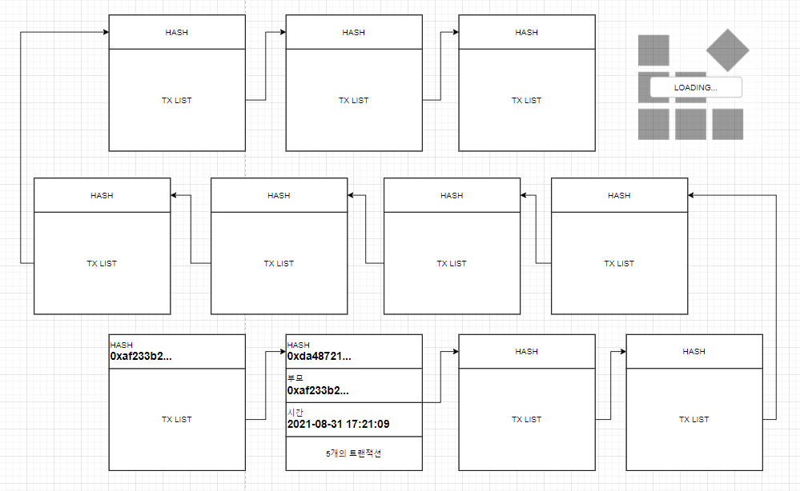
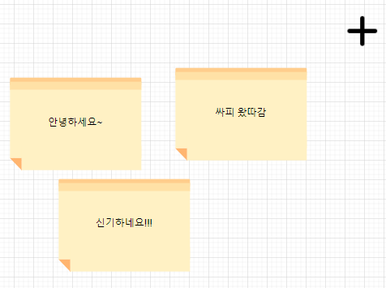

# 설록

## Why

눈에 보이지 않는 블록체인은 이해하기가 어렵습니다.

백문이불여일견

실체가 없는 블록체인을 보여줌으로써 이해를 **급상승**시켜줍니다. 아래와 같은 것들을 이해할 수 있습니다.
- 블록체인은 실제로 체인처럼 연결되어있습니다.
- 암호화폐는 이렇게 사용됩니다.
- 스마트 컨트랙트는 이렇게 활용됩니다.

### Target

- IT는 잘 모르지만 '요즘 비트코인이 핫하던데 블록체인이 뭐지?', '채굴하는 거 때문에 그래픽카드 가격이 급증했는데 왜지?' 라는 궁금증을 가지는 사람
- 궁금은 한데, 찾아보기는 귀찮아서 알아서 떠먹여주기를 바라는 사람
- 블록체인에 첫 걸음을 떼려는 사람

## What

기능 자체는 [etherscan](https://etherscan.io/)과 유사할 수 있으나, 텍스트보다는 이미지 또는 애니메이션을 사용하여 알기 쉽게 합니다.

더 나아가 블록체인을 효과적으로 보여주는 것 뿐 아니라, 블록체인 내에서 상호작용이 가능하도록 하는 Dapp과 유사한 서비스를 추가적으로 제공합니다. 

## How

### 상호작용?

상호작용이 가능한 Dapp과 유사한 서비스는 낙서장을 만들겠습니다. 
- 특정 계정으로 보내는 트랜잭션 내 data는 낙서장에 기록됩니다. 
- 낙서장에는 포스트잇을 붙이는 듯이 렌더링되며, 해당 포스트잇을 클릭하면 해당 트랜잭션이 담긴 블록을 보여줍니다.
- 실제로 내가 데이터를 담은 트랜잭션을 보냈고, 그게 블록체인에 나타나고 있음을 바로 확인할 수 있습니다(실시간으로 상호작용)

### 구현 방법

- 프라이빗 블록체인을 구축합니다.

- 웹 서비스로 제공하며, 프론트엔드 중심으로 프로젝트가 진행됩니다. 백엔드는 이후에 확장 시, 지갑을 관리하거나 낙서장을 관리한다면 해당 정보들을 DB에서 관리할 때 구현합니다.

### 예시

어떤식으로 보여줄지 간단하게 그려봤습니다. 이후 토의를 통해 보여주는 방식은 변경될 수 있습니다.

- 메인 페이지

블록들이 체인처럼 연결되어 있는 것을 가시화합니다. 각 블록이 가진 특징들을 보여줍니다. 블록이 실시간으로 추가되는 것을 보여줍니다.

- 낙서장 페이지

## Team

- 이채하 (팀장)
- 김주형
- 신주환
- 장동균
- 장민호 

### Role

이후에 개발 상황에 따라 역할은 변경될 수 있으며, 확장됨에 따라 백엔드 역할이 추가될 것입니다.

- FE : 장동균, 이채하, 신주환
- Blockchain : 김주형, 장민호 
