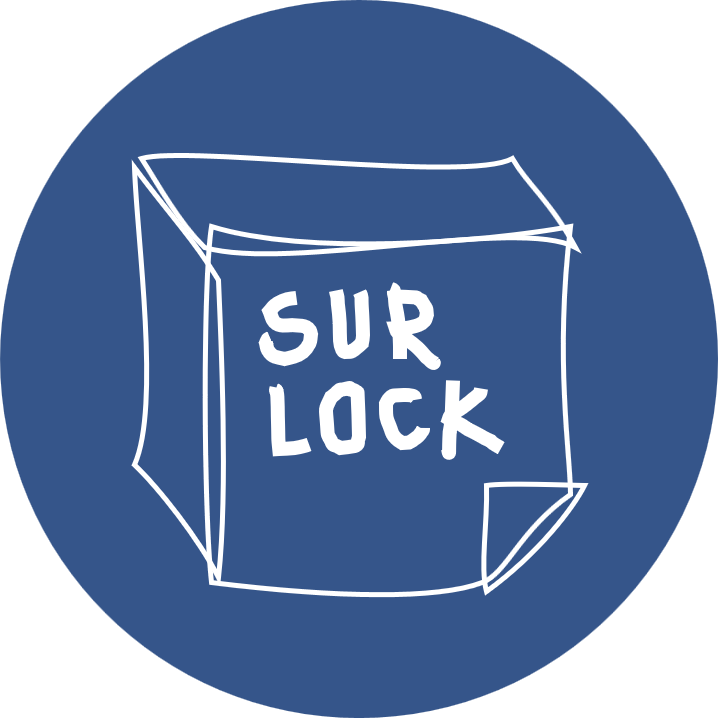

# 🗞️설록: 블록체인 기반 설문조사 서비스

 

	

 

- 투명성과 불변성을 보장하는 블록체인 기반 설문조사 서비스입니다.
- 카카오 아이디만 있다면 누구나 설문조사를 생성하고, 응답하는 것이 가능합니다.
- 블록체인이기 때문에 설문조사 결과는 물론, 그 과정도 모두 투명하게 공개됩니다.

## Demo

[~~SURLOCK HOMEPAGE~~(데모종료)](http://j5a501.p.ssafy.io/)

[DEMO VIDEO](https://drive.google.com/file/d/1ezILafpfyDOOi3jL9Fm4wnbUl5qxfBbd/view?usp=sharing)

## How to use

누구나 쉽게 설문조사를 생성할 수 있고, 응답할 수 있고, 결과를 볼 수 있습니다.

### 설문조사 생성

1. 홈페이지에 접속해서 로그인한 후에, 메뉴 중 "설문생성"을 클릭합니다.
2. 적절한 제목을 입력하고, 우측하단에 "+" 버튼을 통해 원하는 문항을 추가합니다. 선택에 따라서 문항에 이미지를 추가할 수도 있습니다.
3. 각 문항은 작성한 후에 "저장" 버튼을 눌러야 합니다.
4. 우측하단 "+" 버튼에서 "제출"을 클릭하여 설문조사를 제출합니다. ropsten 테스트넷에 저장하기 때문에 시간이 걸릴 수 있습니다.
5. 저장이 완료되면 설문에 참여할 수 있는 링크가 제공됩니다. 해당 링크를 설문에 참여할 사람들에게 전달합니다.

### 설문조사 응답

1. 응답하기 위해서 특정 설문조사에 대한 링크가 필요합니다. 위에서 제공받은 링크에 접속합니다.
2. 적절한 응답을 입력합니다.
3. 우측하단 "+" 버튼에서 "제출"을 클릭하여 응답을 저장합니다. ropsten 테스트넷에 저장하기 때문에 시간이 걸릴 수 있습니다.
4. 저장이 완료되면 결과 페이지로 이동합니다.

### 설문조사 결과

1. 이미 참여한 설문조사 링크로 접속하거나, 설문을 완료하면 결과 페이지로 이동합니다.
2. 해당 설문조사에 대해서 결과를 한 눈에 볼 수 있습니다.

## Team

- 이채하 : Leader, BE
- 김주형 : Blockchain
- 신주환 : FE
- 장동균 : 
- 장민호 : BE, Blockchain
